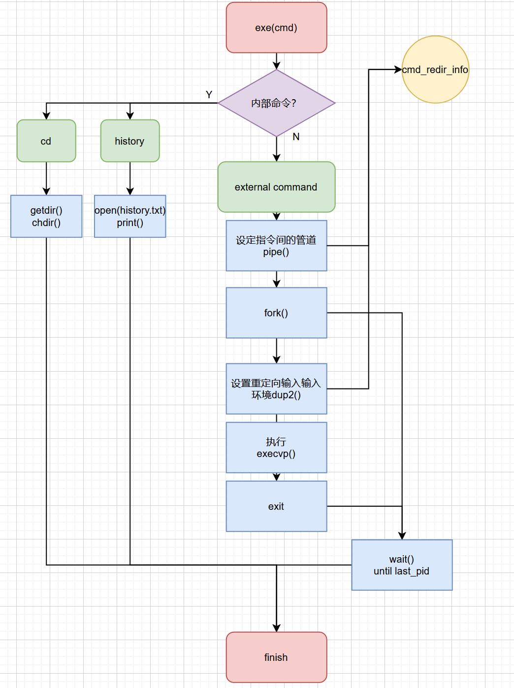
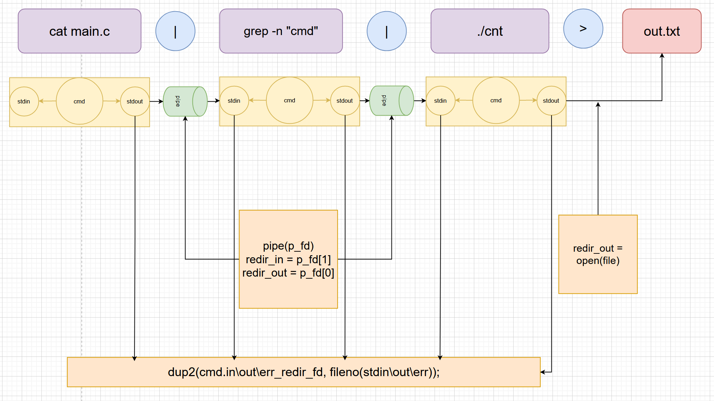
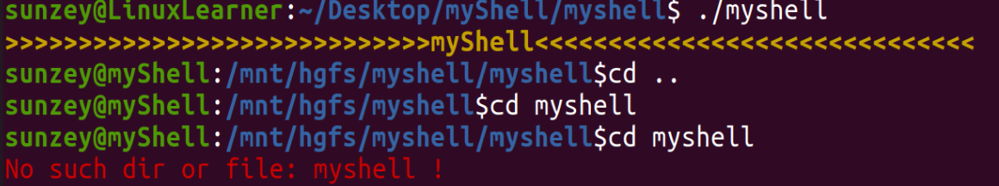

# UNIX 课程大作业报告(简易shell)


## 1. myshell概述

本简易shell是C语言编写的一个为用户提供的Linux操作系统(Ubantu21.04)的命令行式交互界面。基本实现了linux自带的shell的交互命令集合（`cd`, `history`内部命令以及绝大部分外部命令）。支持任意多条命令间的管道流与标准输入、标准输出、标准异常的重定向。并在此基础上实现了键盘监控以支持历史命令的回写（`up` `down`快速使用历史用过的命令）以及不同颜色区分的输出展示。

本shell以学习linux操作系统的重要API为目的，因而遵循类似Minix的简单、体现原理的原则(即阅读实现代码可以对真正的linuxshell的实现过程及原理有一个提纲挈领的理解)。在具体实现中，内部命令cd、history不创建子进程通过chdir等系统调用实现。而对于一般的指令，主要通过创建子进程并调用execvp库函数实现。


## 2. 设计及实现

### a. 整体设计


下面将以从上往下的顺序依次介绍各层设计

1.UI: 这一层中主要实现实时展示合适的命令提示符，并输出stdout、stderr等信息。其中input部分比较特殊，在局部核心设计处详细说明。

2."Class"：这一层实际上是各个.c原文件。在OO思想的指导下进行了较为合理的划分，因而称其为class。由控制（可理解为监测键盘输入并响应）（ctrl）， 输入解析（parse），shell入口（main）和执行指令（exec）四部分组成。

3.Methods：这一层是各个类中的主要方法(有些可能未被完全封装成函数)。

4.Syscall&lib：这一层是本次设计中使用的各种API，包含系统调用和一些重要的库函数。

5.DataStructure：这一层是本次设计中的主要数据结构。比较重要的是struct cmd。log记录了之前输入指令的历史记录。而错误信息实际属于系统帮助我们维护的数据结构。


### b. 局部核心设计

### 1. 键盘监听的实现

ctrl.c是实现键盘监听的主要程序。设计中并未引入新的进程专门监听键盘，而是使用比较特殊的方式，其核心思想是：不在屏幕展现用户实际的输入，屏幕上出现的全部为stdout，具体细节如下：

首先，更改键盘输入的系统设置为不在屏幕展示标准输入（其实winC可以通过`getch`实现， 但linux环境下无此库函数）

```C
	struct termios new_settings;
	struct termios stored_settings;
	tcgetattr(0,&stored_settings);     /*save current settings*/
	new_settings = stored_settings;
 	new_settings.c_lflag &= (~ICANON); /*ignore cache of current line*/
	new_settings.c_lflag &= ~ECHO;     /*set no echo on screen(main)*/
	new_settings.c_cc[VTIME] = 0;      /*set time limit*/
	new_settings.c_cc[VMIN] = 1;       /*set min_char_num limit*/
	tcsetattr(0,TCSANOW,&new_settings);
```

在此基础上，为了实现`up`、`down`键快速使用历史记录中的指令, 需要给用户一种屏幕上展示的是自己的输入的“假象”，需要实时保存一个字符串buffer表示当前被输入的指令。并在用户输入后刷新并展示。在其中对于`\b`键，`up`键 `down`键进行特殊处理。具体代码如下:

```C
	while(in!='\n') {
		in = getchar();
		if (in==127) { // in == '\b'
			if (strlen(cur_cmd)>0) {
				printf("\b");
				printf(" ");
				printf("\b");
				cur_cmd[strlen(cur_cmd)-1] = '\0';
			}
		}
		else if (in==27) { // in == '['
			in = getchar();
			in = getchar();
			if (in==65) { // in == 'up'
				flash();
				strcpy(cur_cmd, log[i]);
				i = ((i-1)<0? (i-1+num_of_cmd) : (i-1))&(num_of_cmd-1);
			} else if (in==66) { // in == 'down'
				flash();
				strcpy(cur_cmd, log[i]);
				i = (i+1)&(num_of_cmd-1);
			}
			printf("%s", cur_cmd);
		}
		else {
			printf("%c", in);
			cur_cmd[strlen(cur_cmd)] = in;
		}	
	}
```

在实际试验时发现，`up`,`down`键实际对应三个字符，在实际使用时，需要维护一个指针指向log中的记录历史并根据按键进行改变， 在实际按下上下键时，会将log中指针对应的指令字符串输出到屏幕上并保留在输入串中。而`\b \b`实际上实现了在屏幕上展示的标准输出中回退一格，以达到backspace的效果。


### 2. cmd结构体

在shell的设计中，核心的结构体cmd的结构如下:


其中ARGV为一个数组指针，其中保存着每个命令的参数，arg_cnt保存这个数组的元素个数。三个int型的文件描述符分别表示该指令的标准输入、标准输出、标准异常的文件描述符，用于实现管道和重定向。

```C
//parce.c中对指令输入输出重定向标志的设置（局部）
if (!strcmp(match, "<")) {
	in_redir = 1;
	is_redirective = 1;
} else if (!strcmp(match, ">") | !strcmp(match, "1>")) {
	out_redir = 1;
	is_redirective = 1;
} else if (!strcmp(match, ">>") | !strcmp(match, "1>>")) {
	out_redir = 1;
	is_append = 1;
	is_redirective = 1;
} else if (!strcmp(match, "$>")) {
	out_redir = 1;
	error_redir = 1;
	is_redirective = 1;
```

```C
//exec.c对指令输入输出重定向的设置（局部）
if(is_append)
	cmds[cmd_i-1].out_redir_fd = open(out_redir_file, OUTR_A_FLAG, MODE);
else
	cmds[cmd_i-1].out_redir_fd = open(out_redir_file, OUTR_FLAG, MODE);	
if(cmds[i].in_redir_fd!=STDIN)
	dup2(cmds[i].in_redir_fd, fileno(stdin));
if(cmds[i].out_redir_fd!=STDOUT)
	dup2(cmds[i].out_redir_fd, fileno(stdout));
if(cmds[i].err_redir_fd!=STDERR)
	dup2(cmds[i].err_redir_fd, fileno(stderr));
```


### 3. 指令的解析

采用正则表达式匹配的方式解析指令，核心模式串为

```JAVA
"([^ ]+|[\"\'].*[\"\'])"
```

即每一个匹配的项为：

1. 不含空格的一串字符
2. 以`'`或`"`括起来的整个字符串

解析伪代码为：

```C
0.初始化模式串，输入输出及重定向的文件名保存的缓存，重定向标识位
LOOP:    
1.找到实现匹配的起止位置确定匹配的子串
2.若为管道（“|”）
    匹配串指针 = 匹配串指针 + 匹配的子串的长度
    增加cmds数组的下标（即认为即将解析新的指令）
    跳过此次循环
3.若为重定向描述符（">", "1>"等）
    设定重定向标识
4.若重定向标识不为0（即上一条匹配的串为重定向标识）
    保存需要重定向的文件名
5.其他情况：
    存入agrv（指令参数）
6.增加匹配串指针，若越界则跳出循环（转8）
7.无条件跳转1
loop_en:
8.结束解析，return
```


### 4. 指令的执行

指令的具体执行分为两种情况：内部命令与外部命令。在myshell中内部命令仅实现了`cd`与`history`， 外部命令则通过子进程调用`execvp`库函数几乎能全部实现。执行的流程图如下：



当然，为了正确地表示指令的标准输入、输出、异常的重定向关系，同时需要根据parse解析出的重定向信息，对每条指令的重定向情况进行设置。下面给出较为复杂的指令的重定向的具体设置：

指令为`cat main.c | grep -n "cmd" | ./cnt > out.txt`  (cnt为输出标准输入的行数的程序)， 其解析及配置重定向环境的流程如下



其中pipe建立了管道，并将cmd结构体的重定向信息设置为管道的输入输出端，对于重定向到文件，则由另一组函数实现cmd的结构体的重定向信息为打开文件的描述符。

上述过程在父进程中直接修改cmd结构体，此后，在调用fork()进入子进程后， 会通过dup2()函数，直接将当前程序执行环境的stdin、stdout、stderr的描述符更改为原先存储在cmd结构体中的描述符，从而在execvp调用的过程中全程实现重定向。除此之外还需注意执行结束后需要关闭文件和管道的读写端。


### 5.颜色显示

在本次设计中实现了不同粗细、颜色的字符输出， 在`color.h`头文件中定义了不同打印方式的宏:

```C
/*set_front_color*/
#define PRINT_FONT_RED  printf("\033[31m"); //red
#define PRINT_FONT_GRE  printf("\033[32m"); //green
#define PRINT_FONT_YEL  printf("\033[33m"); //yellow

/*set_background_color*/ 
#define PRINT_BACK_RED  printf("\033[41m"); //red
#define PRINT_BACK_GRE  printf("\033[42m"); //green
#define PRINT_BACK_YEL  printf("\033[43m"); //yellow
...
```

为了在主程序中的代码逻辑更为清晰，为此定义了一些宏函数，用于灵活地显示颜色:

```c
#define PRINT_END do{             \
	PRINT_ATTR_BOL                \
	PRINT_FONT_YEL                \
	printf(">>>>>>>>>>>>>>>>>>>>>>>>>>myshell_exit<<<<<<<<<<<<<<<<<<<<<<<<<<<<\n");           \
	PRINT_ATTR_REC                \
}while (0)                        

#define PRINT_COLOR(info, color, type) do{    \
	if((color)==1) PRINT_FONT_RED		         \
	else if((color)==2) PRINT_FONT_YEL		  \
	else if((color)==3) PRINT_FONT_BLU        \
	else if((color)==4) PRINT_FONT_GRE         \
	if ((type) == 0) printf("%s", (info));    \
	else if((type) == 1) printf("%s\n", (info)); \
	else printf("%s ", (info));               \
	PRINT_ATTR_REC                            \
}while (0)
```

使用这些宏函数时就能方便地实现不同的打印，如为了模拟ubantu中的shell的`prompt`，设置的`show_prompt`函数如下：

```C
void show_propmt() 
{	
	PRINT_USERNAME(username);
	PRINT_CURRENT_DIR(curPath);
}
```

这样最后展示的prompt效果能与ubantu的完全相同（第一行为unbatu_shell， 此后为myshell的输出）：




## 3. 待扩展的功能和未来改进方向

标题还可以叫”存在~~的笔者也不准备解决~~的缺陷和不足“。

1. 由于并未采用递归下降的语法分析，且实现的正则表达式较为简单，因此无法识别**没有用空格隔开的重定向和管道符号**，如`cat main.c > a`不能写作`cat main.c >a`。未来需要设计的更为复杂的匹配语法。
2. 在键盘监控模式（main中定义了`MONITORED`宏用于设置模式）下，左右键将失效，这意味着输入时仅能通过backspace控制，如果用户之前输错了，就需要一直backspace到错误处重新输入。这种模式的好处是可以通过`up` `down`键实现切换之前用过的指令。而若关闭该模式，则可以获得正常的输入效果。未来需要更进一步设置更为复杂的屏幕显示刷新方式，以达到合两种模式合而为一。
3. 在键盘监控模式下，由于屏幕显示中存在换行回车控制字符，且其显示由ubantu中自带的shell控制，暂时没有找到确定其位置的方法。故如果输入超过一行，换行后再次使用backspace将只能回退到此行首而无法回退到上一行。为了保证正确性，**对于一行很长的指令**建议使用设置模式为非键盘监控模式。
4. 对于error的处理和输出并未统一到某个“class”中，为了更好的面向对象的设计应该设计新的error展示与处理"class"，对错误进行统一管理。同时也可以更进一步提高程序的可维护性。
5. tmp文件夹存储着命令历史，本无存在的必要，但为了更进一步练习相关系统调用而进行了保留（因而不能删除tmp文件夹）。


## 4. 思考与感悟

这是笔者第一次写比较复杂(也许未来会觉得很简单)的C语言实现的程序（总代码量600行左右，实现总时间应当超过了20h）。在一开始拿到这个任务时几乎毫无头绪。只好耗费许多时间阅读晦涩难懂的linuxshell的实现源码，在阅读源码的过程明白了自己应当如何简单实现自己的shell，同时也有很多额外收获（主要关于大型C程序的设计）。实现期间耗费巨量的时间debugs（空指针、分配的内存空间忘了刷新回收、fork和dup2调用由于不理解原理而出现许多使用错误、字符串中控制字符的作用没有理解...）暴露出自己C语言知识不牢固的问题, 也搞得自己情绪上几次失意或是暴躁。但~在最后的最后真正实现了shell的功能并正确执行命令时还是有非常大成就感的。在实现期间也第一次体会到奥卡姆剃刀的作用（见下）。通过本次设计自己的shell，笔者不仅更进一步理解linuxshell指令的执行过程，也巩固了C语言基础。同时也对命令行UI设计中使用C语言实现打印字体颜色的控制、对键盘读入的监控有了更进一步的理解并进行了很好的实践。

奥卡姆剃刀的理解：笔者首先实现了不支持切换历史命令的shell，此后希望进一步实现这一功能时，首先想到的是开辟一个新的进程，执行一个独立的C程序负责监控键盘输入，并将结果反馈到shell程序运行的进程中。刚刚实现这一想法后，却发现这两个进程对于用户的输入是竞争关系。用户的输入无法确定到底输入到哪个进程。后来笔者又开辟了一个新的进程，负责读取用户输入，并通过管道将输入信息重定向到主进程和监控进程中。最后的结果就是：笔者根本无法理解三个进程间交互的过程，也根本找不到无法实现效果的原因。后来与fjh巨佬交流后，发其实根本不需要开辟新的进程，可以通过刷新标准输出的方式给用户以"显示的是自己的输入"的假象，从而顺利地轻松实现了键盘监控。才想起来笔者之前听闻奥卡姆剃刀后幼稚地以为自己根本永远不会出现这样的问题。哈哈哈好幼稚啊~。


注：笔者在代码中较为详细地进行了注释以说明函数的作用和各个变量的含义。具体实现细节可以通过阅读源码实现。